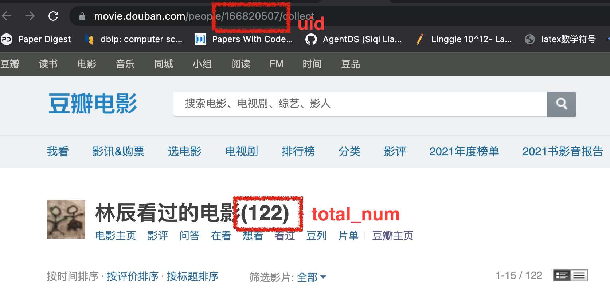
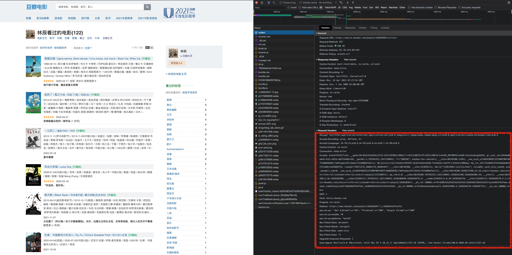
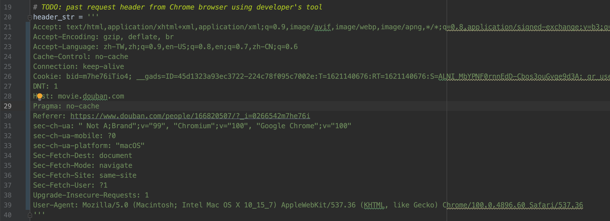
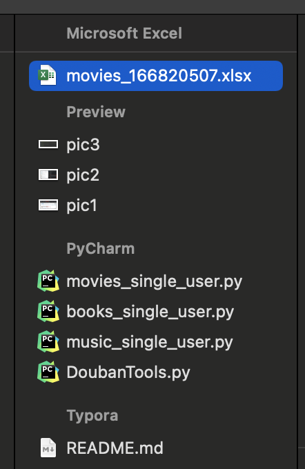

# Douban-User-Spider
Spider for Douban book/movie/music of single user.

Here is an example usage for `movies_single_user.py`

__Steps:__

1. fill in `uid`, `total_num` in `movies_single_user.py`:

   ```python
   uid = "166820507"  # TODO: check the user id from DouBan url
   total_num = 122  # TODO: total number of movies watched by this user
   item_each_page = 15
   all_movies = []
   ```

   for this user's movie information:

   

2. fill in the `header_str` in `movies_single_user.py`, by pasting from browser developer's tool:

   

   copy the whole request header to the `header_str`:

   

3. run the script:

   ```bash
   cd Douban-User-Spider
   
   # in dir Douban-User-Spider/
   python movies_single_user.py
   ```

4. check the output excel `./movies_166820507.xlsx`:

   
